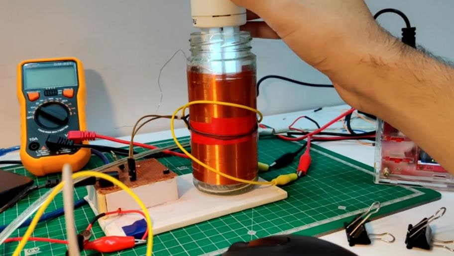
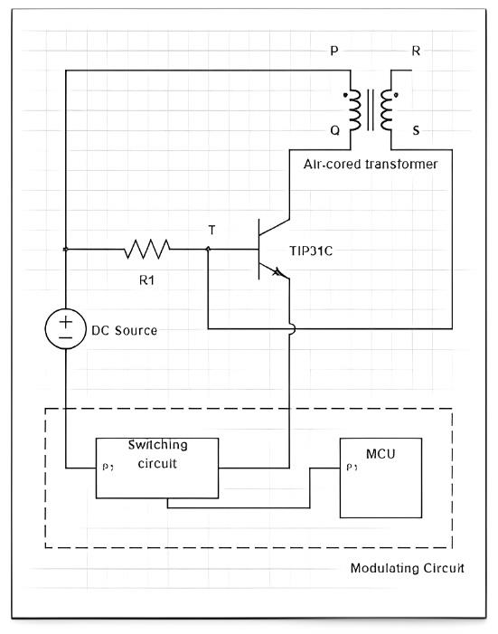
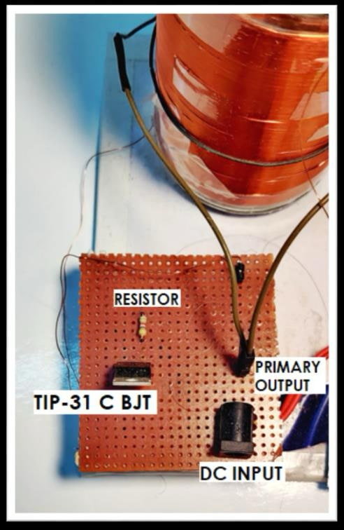
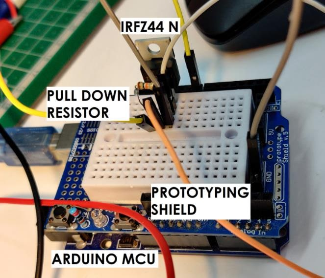
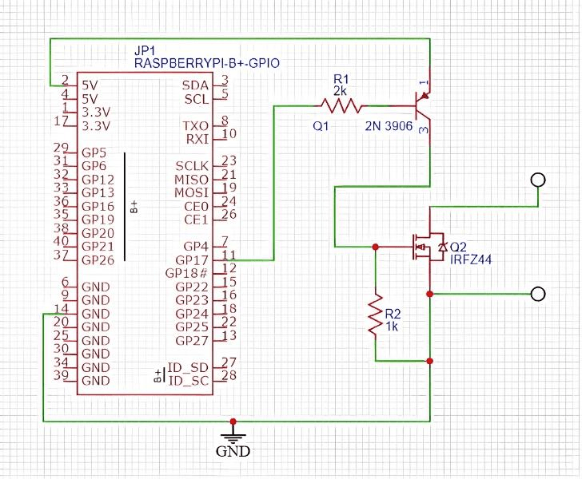
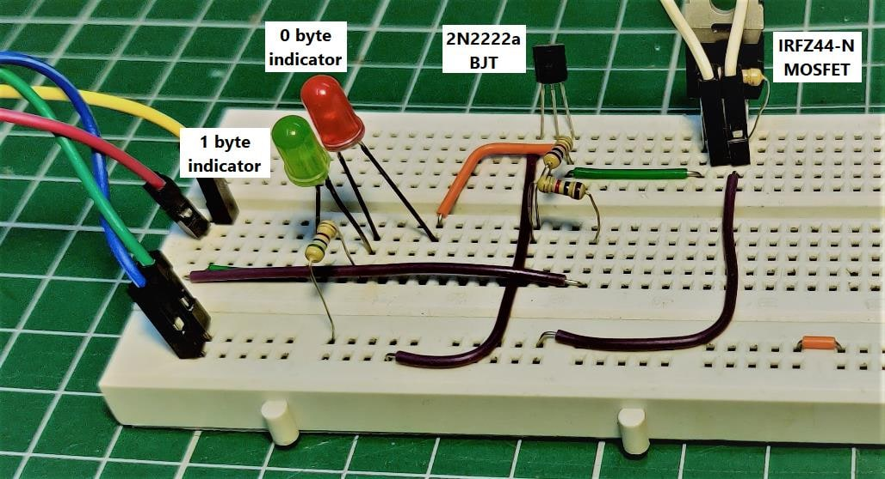
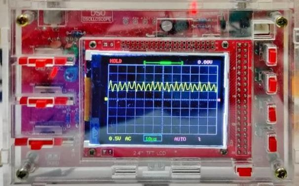
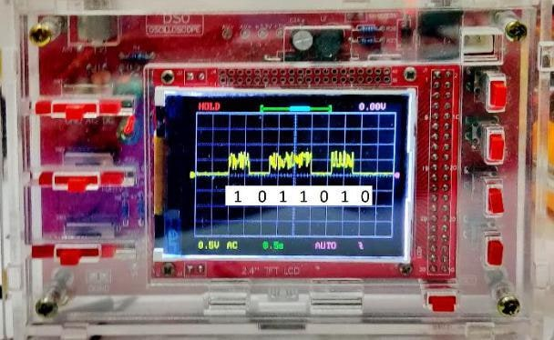

# Tesla Coil

A small Tesla coil that does two things at once: it lights a bulb from across the table with no wires, and it carries a message through the air on the same field. The coil is a Slayer exciter, the message is keyed onto it by a Raspberry Pi, and a Hamming (7,4) code lets the receiver fix bit errors on the way through.



The work was published as a peer-reviewed conference paper: [**Encoding Data Using Slayer Exciter Circuits with Simultaneous Power and Information Transmission**](https://link.springer.com/chapter/10.1007/978-981-96-0047-2_7), in the proceedings of *Recent Developments in Control, Automation and Power Engineering* (RDCAPE 2023), Springer, 2025. It started as my B.Tech project in Electrical Engineering at Delhi Technological University, supervised by Dr. Indra Kumar Chaudhry.

## What it does

- **Wireless power.** The secondary coil throws a high-frequency electromagnetic field that lights a bulb held near it. No contact, no wires.
- **Wireless data.** The Pi switches the coil on and off in a pattern, turning the field into a carrier for binary data. A pickup near the coil reads it back.
- **Error correction.** Every four bits of the message are padded to seven with parity bits. The receiver can detect and correct any single flipped bit, which matters when the channel is a spark coil.
- **One circuit for both.** The same coil, the same drive transistor and the same field do the power transfer and the data link.

## How it works

```
message  →  Raspberry Pi  →  Hamming (7,4) encode  →  GPIO  →  2N3906  →  IRFZ44N MOSFET
                                                                               ↓
           bulb lights up  ←  Slayer exciter field  ←  TIP31C + air-cored transformer
                                                                               ↓
                     pickup  →  oscilloscope  →  bursts = bits  →  decode  →  message
```

### 1. Wireless power

A Slayer exciter is the simplest Tesla coil there is: an air-cored transformer with a few turns on the primary, hundreds on the secondary, and a single transistor acting as a switch. When the transistor conducts, current through the primary induces a voltage in the secondary that pulls the transistor's base low and switches it off. Lenz's law then swings the secondary the other way, the base goes high, and the transistor conducts again. The cycle repeats at the coil's resonant frequency, so a low DC input becomes a high-frequency, high-voltage AC output with nothing more than a transistor and a resistor.



The field around the secondary is strong enough to light a bulb held above the coil.



### 2. Encoding and modulation

The Raspberry Pi takes a message, splits it into 4-bit nibbles and runs each through a Hamming (7,4) encoder, which adds three parity bits. The resulting 7-bit codewords go out one bit at a time on a GPIO pin that keys the exciter's supply.

This is amplitude-shift keying at its most basic: coil on is a `1`, coil off is a `0`. Each bit holds the coil in its state for a fixed interval, so the receiver only has to sample at the same rate. A relay would give better isolation, but a MOSFET switches far faster, so an IRFZ44N does the keying.


The first prototype keyed the MOSFET from an Arduino, which worked but needed a PC on the serial port to feed it data.



Moving to a Raspberry Pi made the transmitter standalone, with one catch: its GPIO pins are 3.3 V and the IRFZ44N wants 5 V on the gate. A 2N3906 PNP transistor between the pin and the gate lifts the signal to the Pi's 5 V rail. It also inverts it, so the program sends inverted bits.





### 3. Reception

A pickup near the coil sees the carrier as a continuous high-frequency wave while the coil is on.



With the message keyed on, the carrier arrives in bursts, one burst per `1` bit, and the bitstream can be read straight off the trace. Grouping the bits back into sevens and running the Hamming decoder recovers the nibbles, and with them the original message, even if a bit was lost to noise along the way.



## Hamming (7,4) in brief

Four data bits `d1 d2 d3 d4` become seven bits with three parity bits placed at positions 1, 2 and 4:

```
position:  1   2   3   4   5   6   7
bit:       p1  p2  d1  p3  d2  d3  d4

p1 = d1 ⊕ d2 ⊕ d4
p2 = d1 ⊕ d3 ⊕ d4
p3 = d2 ⊕ d3 ⊕ d4
```

On receipt, recomputing the three parities gives a 3-bit syndrome. Zero means the codeword is clean; any other value is the position of the single bit that flipped, so the decoder just inverts it. The cost is 75% more bits on the wire, which is cheap for a channel this noisy.

A reference encoder for the Pi fits in a few lines of Python:

```python
def hamming74(nibble):            # nibble: 4 data bits, MSB first
    d1, d2, d3, d4 = nibble
    p1 = d1 ^ d2 ^ d4
    p2 = d1 ^ d3 ^ d4
    p3 = d2 ^ d3 ^ d4
    return [p1, p2, d1, p3, d2, d3, d4]
```

Each returned bit is written to the GPIO pin (inverted, because of the PNP stage), held for one bit period, and the pin is cleared between codewords.

## Parts

- Slayer exciter: a hand-wound secondary on a glass jar, a few-turn primary, a TIP31C NPN power transistor and a base resistor, on a low-voltage DC supply
- Raspberry Pi (any model with GPIO) for encoding and keying
- IRFZ44N n-channel MOSFET as the switch, with a 2N3906 PNP level shifter and a 1 kΩ gate pull-down
- A bulb or fluorescent tube as the wireless load
- A pickup and an oscilloscope for the receiver

## Build it

1. Wind and wire the Slayer exciter. Check that a bulb lights near the secondary before adding anything else.
2. Put the MOSFET in series with the exciter's supply and drive its gate from a Pi GPIO pin through the PNP level shifter.
3. Encode the message with Hamming (7,4) and bit-bang the codewords onto the GPIO pin at a fixed bit rate.
4. Place the pickup near the coil and watch the bursts on the oscilloscope.
5. Sample the trace at the bit rate, group into sevens, decode, and read the message back.

## Where this goes

The same idea scales to wireless charging, short-range sensors, and Li-Fi-style links where light or a field stands in for a cable. The interesting part was never the coil on its own. It was that a single noisy field can deliver energy and a reliable message at the same time.

## Publication

- **Encoding Data Using Slayer Exciter Circuits with Simultaneous Power and Information Transmission.** In *Recent Developments in Control, Automation and Power Engineering (RDCAPE 2023)*, Springer, 2025. DOI: [10.1007/978-981-96-0047-2_7](https://doi.org/10.1007/978-981-96-0047-2_7)

## Repository

```
images/   photos, schematics and oscilloscope traces from the project report
```
